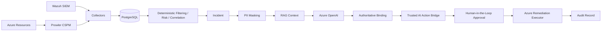

# SentinelMind AI

[](https://github.com/ozenesatt/sentinelmind/actions/workflows/ci.yml)

**AI-assisted cloud security triage, correlation and human-approved remediation for Azure.**

SentinelMind AI is an Azure-focused security reference project that combines cloud posture findings, endpoint/SIEM telemetry, deterministic security logic and retrieval-augmented AI analysis.

The project is intentionally designed around one core principle:

> **AI analyzes and recommends. Trusted systems validate. Humans approve.**

The LLM does not directly detect threats, calculate the authoritative risk score, or make unrestricted changes to Azure resources.

## Architecture



## End-to-End Flow

1. **Prowler** and **Wazuh** provide security findings and telemetry.
2. Collectors normalize and persist raw events in PostgreSQL.
3. Deterministic logic performs filtering, scoring and correlation.
4. Incidents are created from authoritative security data.
5. PII is masked before information is sent to the LLM.
6. RAG retrieves relevant MITRE ATT&CK, CIS Azure and KVKK context.
7. Azure OpenAI produces a structured security analysis and recommendation.
8. Authoritative fields are rebound from trusted source data.
9. The Trusted AI Action Bridge validates supported recommendations against source evidence.
10. A remediation action remains pending until a human approves it.
11. The remediation executor performs a dry-run by default and requires explicit execution for a real Azure change.
12. The final result is persisted as an auditable action record.

## Core Components

### Platform & Cloud

- Azure infrastructure managed with Bicep
- Isolated demo and holdout infrastructure
- Prowler OCSF ingestion into PostgreSQL
- Wazuh alert ingestion
- FastAPI incident/action interfaces
- Web-based Human-in-the-Loop approval
- Azure NSG remediation executor
- Repeatable Bicep-based demo reset
- GitHub Actions CI

### Detection & AI

- Deterministic filtering and risk scoring
- Incident correlation
- Windows failed-logon correlation
- Sigma validation scenarios
- Detection evaluation and threshold tooling
- Experimental scoring V2 and holdout workflow
- PII masking before LLM processing
- RAG over MITRE ATT&CK, CIS Azure Foundations and KVKK context
- Structured Azure OpenAI analysis
- Authoritative field binding
- Trusted AI Action Bridge

## Security Boundaries

SentinelMind is designed to fail closed at the AI-to-action boundary.

- The LLM does **not** directly execute Azure commands.
- Risk scoring is deterministic rather than LLM-generated.
- Raw event data remains preserved in PostgreSQL.
- PII masking is applied immediately before LLM processing.
- Source MITRE mappings remain authoritative when available.
- AI recommendations are checked against trusted source events.
- The validated remediation path is intentionally narrow.
- Human approval is required before real remediation.
- Remediation operates in dry-run mode unless explicit execution is requested.
- Action state and execution results remain auditable in PostgreSQL.

The currently validated AI-to-remediation bridge supports the controlled `close_nsg_rule` path. Other action types must not be presented as production-validated remediation paths.

## Validated Azure Scenario

The primary end-to-end demonstration uses a real Prowler finding for an Azure Network Security Group that allows inbound SSH on TCP/22 from the Internet.

Validated flow:

```text
Prowler finding
  -> PostgreSQL event
  -> deterministic incident
  -> RAG + Azure OpenAI analysis
  -> authoritative binding
  -> Trusted AI Action Bridge
  -> pending action
  -> human approval
  -> remediation dry-run
  -> explicit Azure execution
  -> NSG rule deletion
  -> PostgreSQL audit result
  -> Bicep demo reset
```

For the validated scenario, the intentionally insecure `DEMO-Insecure-SSH-Any` NSG rule was removed through the approved remediation flow, its absence was verified in Azure, the action was recorded as executed, and the demo rule was subsequently restored with Bicep for repeatability.

## Detection and Evaluation

The repository includes:

- baseline detection evaluation
- threshold evaluation
- Sigma rules and validation scenarios
- failed-logon correlation
- Wazuh event normalization
- scoring V2 experimentation
- holdout dataset tooling
- isolated Azure holdout infrastructure in `infra/holdout.bicep`

The holdout infrastructure has been Bicep-build validated and is separated from the main demo environment. A real independent holdout result must not be claimed until a new unseen Prowler dataset has been scanned, labeled and evaluated.

## Testing and CI

GitHub Actions installs project dependencies, compiles critical modules and runs the deterministic non-integration pytest suite on pull requests and pushes to `main`.

The RAG pipeline test that depends on a local Chroma collection is explicitly marked as an integration test and is excluded from the standard CI run.

Recent merged project changes have passed the SentinelMind CI workflow.

## Repository Structure

| Path | Purpose |
| --- | --- |
| `collector/` | Prowler and Wazuh ingestion |
| `engine/` | Filtering, risk, correlation, incident production and trusted action validation |
| `rag/` | PII masking, retrieval, Azure OpenAI analysis and authoritative binding |
| `api/` | FastAPI read/action interfaces |
| `hitl/` | Human-in-the-Loop web approval interface |
| `actions/` | Approved Azure remediation executor |
| `infra/` | Bicep infrastructure, demo reset and holdout environment |
| `eval/` | Detection, scoring and holdout evaluation tooling |
| `sigma/` | Detection rules and validation scenarios |
| `tests/` | Automated security and regression tests |
| `docs/` | Contracts, runbooks, status and final project documentation |

## Documentation

- [Platform & Cloud Final Status](docs/platform_cloud_final_status.md)
- [Detection & AI Final Status](docs/detection_ai_final_status.md)
- [Deployment and Demo Runbook](docs/deployment_runbook.md)
- [Final Demo Flow](docs/final_demo_flow.md)
- [Final Presentation Outline](docs/final_presentation_outline.md)
- [AI Safety Model](docs/ai_safety.md)
- [Detection Metrics](docs/detection_metrics.md)
- [Data Contracts](docs/contracts.md)
- [Database Schema](docs/schema.sql)
- [RAG Documentation](rag/README.md)
- [Evaluation Documentation](eval/README.md)

## Quick Validation

Install the project dependencies in an isolated Python environment and run:

```bash
python -m pytest -q -m "not integration"
```

Validate the isolated holdout Bicep template with:

```bash
az bicep build --file infra/holdout.bicep
```

For database, API, Azure deployment, ingestion, HITL and remediation steps, use the [Deployment and Demo Runbook](docs/deployment_runbook.md).

## Current Project Status

**Functional MVP: Validated**

The primary Azure/Prowler-to-human-approved-remediation path has been demonstrated end to end with real Azure resources, database persistence, AI analysis, trusted validation, human approval, remediation audit and environment reset.

The following items remain optional or environment-dependent rather than blockers for the functional MVP:

- independent Prowler holdout dataset evaluation
- real Wazuh 4625 validator execution on an exported dataset
- a second Wazuh-to-AI end-to-end scenario
- tenant-side Microsoft Teams workflow provisioning
- production-grade authentication and CSRF protection for the local HITL web interface
- production hardening for additional remediation action types

The Teams backend components exist, but tenant-side Teams provisioning depends on organizational Microsoft 365 access and must not be represented as a fully completed Teams deployment.

## Project Roles

- **Platform & Cloud:** Esat Özen
- **Detection & AI:** Sıla

## Scope

SentinelMind AI is a controlled security engineering and internship project. Demo infrastructure intentionally contains insecure configurations for detection and remediation validation. It is not intended to be deployed unchanged as a production security platform.
